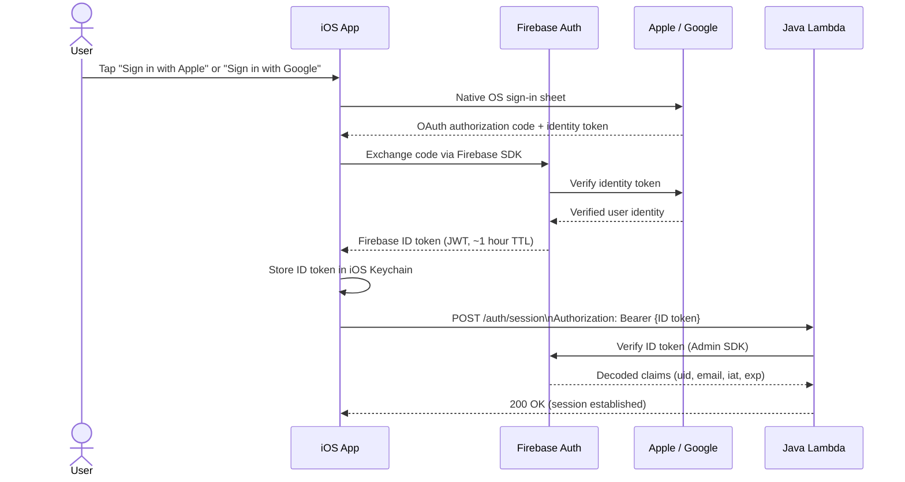

# Authentication & Authorization Design

## System Context

- **Platform**: iOS mobile app + Java Lambda backend
- **Identity Provider**: Firebase Auth (Google-managed)
- **Sign-in Methods**: Sign in with Apple, Sign in with Google
- **Session Storage (client)**: iOS Keychain
- **MVP Role Model**: Single role (User); no admin or multi-tenant requirements

---

## 1. Authentication Method

### Firebase Auth with Federated Identity (Apple / Google)

The app delegates authentication entirely to Firebase Auth. The app does not manage passwords, OTP codes, or MFA directly.

**Sign-in Flow**:



**Why Firebase Auth**:
- Handles credential security, MFA, and account linking at the identity provider level (Apple / Google)
- Firebase ID tokens are short-lived (default 1 hour) and cryptographically signed by Google
- Firebase Admin SDK provides server-side token verification without network round-trips on every call (uses cached public keys)
- Token revocation is supported via Firebase Admin SDK for account suspension or forced sign-out

---

## 2. Session Token Management

### Token Lifecycle

| Property | Value | Rationale |
|----------|-------|-----------|
| Token type | Firebase ID token (RS256 JWT) | Industry standard, Google-signed |
| TTL | ~1 hour (Firebase default, not configurable per-token) | Short-lived reduces window for stolen token abuse |
| Refresh | Firebase SDK refreshes automatically using a long-lived refresh token | Transparent to user; refresh token stored securely by Firebase SDK |
| Refresh token TTL | Up to 1 year (Firebase default); revocable via Admin SDK | Allows persistent sign-in without re-authentication |
| Client storage | iOS Keychain (via Firebase iOS SDK, which uses Keychain internally) | Keychain is hardware-backed, inaccessible to other apps, encrypted at rest |

### Token Validation (Server-Side)

Every API request must be validated as follows:

1. Extract the `Authorization: Bearer {token}` header.
2. Verify the token using `FirebaseAuth.getInstance().verifyIdToken(idToken)` (Firebase Admin SDK for Java).
3. Check that the `aud` (audience) claim matches the Firebase project ID.
4. Check that the `iss` (issuer) claim matches `https://securetoken.google.com/{project-id}`.
5. Reject tokens with `exp` in the past (Admin SDK handles this automatically).
6. Extract the `uid` from the decoded token claims - this is the authoritative user identity for all downstream authorization decisions.
7. Never use `uid` or other identity claims supplied by the client in the request body or query parameters for authorization decisions.

**Java Lambda pattern**:

```java
// In a shared middleware / filter invoked before every handler
FirebaseToken decodedToken = FirebaseAuth.getInstance().verifyIdToken(idToken);
String uid = decodedToken.getUid();
// Attach uid to request context for downstream use
```

### Token Revocation

Firebase supports server-side refresh token revocation. Use this for:
- Account deletion (revoke all tokens before removing user data)
- Suspected account compromise (support/admin action)
- Forced sign-out from all devices

```java
// Revoke all refresh tokens for a user (they must re-authenticate)
FirebaseAuth.getInstance().revokeRefreshTokens(uid);
```

For revocation to take effect on the ID token (within the ~1-hour TTL window), call `verifyIdToken(idToken, true)` with `checkRevoked = true` on security-sensitive endpoints (e.g., account deletion, payment actions). This adds a network round-trip to Firebase but provides immediate revocation guarantees.

---

## 3. API Authorization

### Bearer Token Pattern

All Lambda endpoints that handle user data require a valid Firebase ID token:

```
Authorization: Bearer {firebase-id-token}
```

Requests without a valid `Authorization` header return `401 Unauthorized`.

Requests with a valid token but attempting to access another user's resource return `403 Forbidden`.

### Authorization Checks

**MVP Role Model**: All authenticated users have identical capabilities. There is no admin role exposed via the public API. Admin operations (e.g., user deletion, data migration) are performed via direct Lambda invocation using IAM permissions, not through the public API.

**Ownership-Based Authorization**:

Every resource (invite, RSVP, profile, push token) is associated with a `userId` field in the database. Before any read or write, the Lambda handler must verify:

```java
if (!resource.getUserId().equals(authenticatedUid)) {
    throw new ForbiddenException("Access denied");
}
```

This check must happen in the business logic layer, not only at the query layer, to prevent indirect access through join queries or batch endpoints.

**Social Signals (Read-Only Aggregates)**:

Invite counts, RSVP counts, and friend status are aggregate views. For MVP, these are returned only in the context of the authenticated user's own invites and events. No endpoint exposes another user's aggregate counts without an explicit friendship relationship in place.

### Permission Matrix (MVP)

| Action | Unauthenticated | Authenticated User |
|--------|-----------------|-------------------|
| Sign in | Allowed | N/A |
| View own profile | Denied | Allowed |
| View own invites (4-week history) | Denied | Allowed |
| Create invite | Denied | Allowed (rate limited) |
| RSVP to invite | Denied | Allowed (own RSVPs only) |
| View another user's invites | Denied | Denied |
| View social signals for own events | Denied | Allowed |
| Register / update push token | Denied | Allowed (own token only) |
| Delete own account | Denied | Allowed |
| Admin operations | Denied | Denied (IAM-only) |

---

## 4. Push Token Security

Push tokens (APNs device tokens or FCM registration tokens) allow the backend to send notifications to specific devices. They must be handled carefully to prevent notification interception or spam.

### Registration

- Push token registration requires a valid Firebase ID token (same as all other API calls).
- The backend binds the push token to the authenticated user's `uid`:
  ```
  PUT /users/me/push-token
  Authorization: Bearer {firebase-id-token}
  Body: { "token": "{device-push-token}", "platform": "apns" | "fcm" }
  ```
- The backend overwrites any existing token for the `(uid, platform)` pair - a user can only have one active token per platform per device type in MVP.
- Push tokens must never be returned in any API response.
- Push tokens must be excluded from application logs and error messages.

### Stale Token Cleanup

- APNs and FCM return delivery failure codes when a push token is invalid or the user has uninstalled the app.
- The Lambda push notification handler must check delivery responses and delete stale tokens from the database on receipt of a permanent failure code (APNs: `BadDeviceToken`, `Unregistered`; FCM: `UNREGISTERED`).
- On user sign-out, the iOS app calls `DELETE /users/me/push-token` to remove the token server-side.
- On account deletion, all push tokens for the user must be deleted before the account record is removed.

### Notification Authorization

Before sending a push notification, the Lambda handler must verify that:
- The target user exists and is active.
- The notification is triggered by a legitimate system event (invite created, RSVP updated), not a direct API call.
- Push notifications are never sent as a result of unauthenticated or unauthorized requests.

---

## 5. Email Verification and Email Sends

### Email Address Source

User email addresses are obtained from Firebase Auth claims (`decodedToken.getEmail()`). Firebase Auth verifies email addresses for Google sign-in (email is tied to the Google account). For Apple sign-in, Apple provides a relay email address; Firebase surfaces whatever Apple provides.

### Email Verification Status

Firebase ID token claims include `email_verified`. For actions that involve sending email to the user (e.g., invite notifications via email):
- Check `decodedToken.isEmailVerified()` before sending email.
- If `email_verified` is false, do not send email to that address; log and skip.

### Email Usage Policy

- Email addresses are used only for transactional notifications (invite emails, account-related messages).
- Email addresses must not be returned to other users via any API endpoint.
- Email addresses must be redacted (e.g., shown as `w***@example.com`) in any log output.
- The email field in the database must not be included in API responses that are shared across users.

### Email Send Rate Limiting

- Limit transactional email sends to a maximum of 10 emails per user per day to prevent the notification system from being weaponized as a spam vector.
- Enforce this limit server-side in the Lambda handler before calling the email service.

---

## 6. Implementation Checklist

### Token Validation
- [ ] Firebase Admin SDK initialized at Lambda cold start (not per-request)
- [ ] `verifyIdToken()` called on every request to a protected endpoint
- [ ] `checkRevoked = true` used on account deletion and security-sensitive endpoints
- [ ] `uid` extracted from verified token claims; client-supplied identity fields ignored
- [ ] `401 Unauthorized` returned for missing or invalid tokens
- [ ] `403 Forbidden` returned for valid tokens accessing unauthorized resources

### Session / Keychain Storage (iOS)
- [ ] Firebase iOS SDK stores tokens in Keychain (default behavior - do not override to UserDefaults)
- [ ] Token refresh handled automatically by Firebase iOS SDK
- [ ] On sign-out: call `Auth.auth().signOut()` to clear Keychain tokens
- [ ] On account deletion: revoke Firebase refresh tokens server-side, then clear client Keychain

### Ownership Authorization
- [ ] All invite read/write operations check `invite.userId == authenticatedUid`
- [ ] All RSVP read/write operations check `rsvp.userId == authenticatedUid`
- [ ] All push token operations check `token.userId == authenticatedUid`
- [ ] Database queries filter by `userId = :uid` (not fetch-all-then-filter)
- [ ] Resource IDs are UUIDs (non-sequential) to prevent IDOR enumeration

### Push Token Security
- [ ] Push token registration endpoint requires valid Firebase ID token
- [ ] Push tokens stored bound to `uid` in database
- [ ] Push tokens never returned in any API response
- [ ] Push tokens excluded from Lambda log output
- [ ] Stale token cleanup on APNs/FCM delivery failure
- [ ] Push token deleted on user sign-out
- [ ] All push tokens deleted on account deletion

### Email Security
- [ ] Email addresses never returned in cross-user API responses
- [ ] Email addresses redacted in logs
- [ ] `email_verified` checked before sending email
- [ ] Email send rate limit: max 10 per user per day

### Rate Limiting
- [ ] Invite creation: max 20 per user per hour (enforced at Lambda layer)
- [ ] Email sends: max 10 per user per day
- [ ] API Gateway throttling configured (burst + steady-state limits)
- [ ] Auth endpoints protected by Firebase Auth's built-in rate limiting
