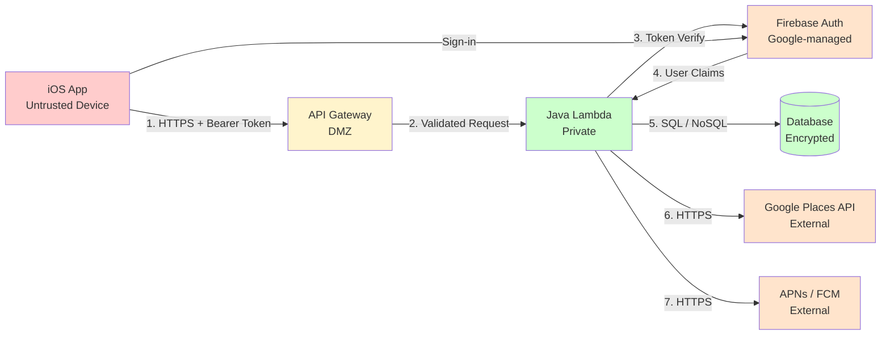

# Threat Model: Location Notifier Social Gathering App

## System Overview

**Description**: An iOS mobile app that enables users to create and manage social gathering invites. Users authenticate via Apple or Google (Firebase Auth), select a city from a dropdown, and interact with invite/RSVP data. The Java Lambda backend processes requests and stores user profiles, push tokens, invites, and email addresses.

**Trust Boundaries**:
- Internet / iOS App (untrusted device) <-> Java Lambda API (HTTPS via API Gateway)
- Java Lambda <-> Firebase Auth (HTTPS, Google-managed)
- Java Lambda <-> Google Places API (HTTPS, Google-managed)
- Java Lambda <-> Database (encrypted connection, private network)
- Java Lambda <-> Push Notification Service (HTTPS, Apple APNs / FCM)

## Data Flow Diagram

**Legend**:
- Red: Untrusted (external / device)
- Yellow: DMZ (API Gateway, semi-trusted)
- Green: Trusted (internal private network)
- Orange: Third-party managed (assumed secure, limited control)

## Assets to Protect

| Asset | Classification | Impact if Compromised |
|-------|----------------|-----------------------|
| Firebase ID tokens / session tokens | Secret | Critical - full account takeover |
| User email addresses | Confidential | High - spam, phishing, privacy breach |
| Push notification tokens (APNs/FCM) | Confidential | Medium - unsolicited notifications, device fingerprinting |
| Invite / RSVP data | Internal | Medium - privacy breach, social graph exposure |
| User city selection | Internal | Low - minimal sensitivity |
| Social signals (invite counts, RSVP counts, friend status) | Internal | Low-Medium - inference of social graph |
| User profiles | Confidential | High - PII exposure |
| Backend source code / Lambda config | Internal | Medium - vulnerability discovery |
| Database credentials / API keys | Secret | Critical - full data breach |

## STRIDE Threat Analysis

### Spoofing (Identity)

**Threat**: Attacker impersonates a legitimate user or service.

| ID | Threat | Attack Vector | Likelihood | Impact | Mitigation |
|----|--------|---------------|------------|--------|------------|
| S1 | Stolen / replayed Firebase ID token | Attacker intercepts or exfiltrates a valid short-lived ID token and replays it to the Lambda API | Low | High | Enforce HTTPS everywhere; tokens are short-lived (1 hour by default); validate `aud` and `iss` claims on every request; revoke tokens on suspicious activity via Firebase Admin SDK |
| S2 | Forged JWT (weak validation) | Attacker crafts a JWT with an arbitrary `uid` if the backend does not properly verify the Firebase signature | Low | Critical | Always verify Firebase ID tokens using the official Firebase Admin SDK (cryptographic signature check against Google's public keys); never trust unverified token claims |
| S3 | Account takeover via weak Apple/Google credentials | Attacker gains access to a user's Apple ID or Google account via phishing or credential stuffing | Medium | Critical | Delegated to Firebase Auth / Apple / Google (outside app control); mitigate by prompting users to enable MFA on their identity provider; detect suspicious sign-in patterns via Firebase |
| S4 | Push token spoofing (registering another user's push token) | Attacker registers a valid push token under their own account to intercept another user's notifications | Low | Medium | Bind push tokens to authenticated user IDs at registration; validate that the token being registered belongs to the authenticated user's session; clean up stale tokens on sign-out |

### Tampering (Data)

**Threat**: Attacker modifies data in transit or manipulates API requests.

| ID | Threat | Attack Vector | Likelihood | Impact | Mitigation |
|----|--------|---------------|------------|--------|------------|
| T1 | Manipulating invite/RSVP ownership | Authenticated user modifies the `userId` or `inviteId` in an API request to accept/decline invites on behalf of another user | High | High | Server-side: validate that the resource's `userId` matches the authenticated user's `uid` from the verified Firebase token on every write operation; never trust client-supplied ownership fields |
| T2 | Injecting malicious content into user-supplied fields | Attacker injects script, SQL, or OS commands via display names, invite titles, or other text fields | Medium | Medium | Validate and sanitize all user input server-side; use parameterized queries or a typed ORM; apply output encoding when rendering user-generated content; enforce max length constraints |
| T3 | Replay attack on state-changing endpoints | Attacker captures a valid signed request and replays it (e.g., to RSVP multiple times) | Low | Low | Firebase ID tokens are short-lived; idempotency keys on create endpoints; database-level unique constraints on invite/RSVP records per user |
| T4 | Man-in-the-middle on API calls | Attacker on the same network intercepts traffic between the iOS app and the API | Low | High | Enforce TLS 1.2+ (TLS 1.3 preferred) on all API Gateway endpoints; iOS App Transport Security (ATS) enforces HTTPS by default; consider certificate pinning for high-risk endpoints |

### Repudiation (Non-repudiation)

**Threat**: Attacker or user denies performing an action.

| ID | Threat | Attack Vector | Likelihood | Impact | Mitigation |
|----|--------|---------------|------------|--------|------------|
| R1 | User denies sending an invite | User claims they did not create an invite that others received | Low | Medium | Audit log all invite creation events with Firebase `uid`, timestamp, IP address, and invite payload hash; store logs in an append-only location (e.g., CloudWatch Logs with immutable retention) |
| R2 | User denies changing RSVP status | User claims their RSVP was altered without their knowledge | Low | Low | Audit log all RSVP state changes with `uid`, timestamp, previous state, and new state; surface a "history" view in-app so users can see their own actions |

### Information Disclosure (Confidentiality)

**Threat**: Attacker gains access to data they should not see.

| ID | Threat | Attack Vector | Likelihood | Impact | Mitigation |
|----|--------|---------------|------------|--------|------------|
| I1 | Accessing another user's invite history or profile | Authenticated user queries `/users/{otherUserId}/invites` or `/invites/{id}` for records not belonging to them | High | High | Enforce ownership checks on every read: compare resource `userId` to authenticated `uid`; apply row-level filtering in all database queries rather than fetching-then-filtering in application code |
| I2 | Email address exposure | User email addresses returned in API responses to other users, or logged in plaintext | Medium | High | Never return email addresses to other users; redact emails from application logs and error messages; store emails encrypted at rest if technically feasible |
| I3 | Social graph inference from aggregate signals | Attacker enumerates invite/RSVP counts or friend status for arbitrary user IDs to map the social graph | Medium | Medium | Return social signals (counts, friend status) only for the authenticated user's own context; do not expose aggregates for arbitrary user IDs without explicit friendship consent |
| I4 | Push token leakage | Push tokens exposed in API responses, logs, or error messages | Low | Medium | Store push tokens server-side only; never return them in API responses to the client; exclude from logs; clean up tokens on account deletion |
| I5 | Verbose error messages leaking system internals | Lambda error responses include stack traces, database connection strings, or internal paths | Medium | Low | Return generic error messages to clients (e.g., `{"error": "Internal server error"}`); log full error detail internally only in CloudWatch; set up structured error handling in all Lambda handlers |
| I6 | Database data breach | Attacker gains access to the database through credential theft or misconfiguration | Low | Critical | Encrypt data at rest (AES-256); use IAM-based database authentication rather than static credentials; restrict database to private network (no public endpoint); rotate credentials regularly |

### Denial of Service (Availability)

**Threat**: Attacker disrupts service availability.

| ID | Threat | Attack Vector | Likelihood | Impact | Mitigation |
|----|--------|---------------|------------|--------|------------|
| D1 | Invite spam (flooding other users with invites) | Authenticated attacker sends thousands of invites to a target user, flooding their notification feed | Medium | Medium | Per-user rate limit on invite creation (e.g., 20 invites per hour); daily caps; enforce at API Gateway and Lambda middleware layers |
| D2 | Push notification spam | Attacker triggers mass notifications by exploiting the invite creation endpoint | Medium | Medium | Rate limiting on invite creation (D1 mitigates this); implement push notification batching and de-duplication; monitor push delivery rates per user |
| D3 | Unauthenticated API enumeration / DDoS | Attacker bombards unauthenticated or lightly authenticated endpoints to exhaust Lambda concurrency | Medium | Medium | API Gateway throttling (e.g., 1000 req/s burst, 500 req/s steady); AWS WAF for IP-based rate limiting; Lambda reserved concurrency limits |
| D4 | Account lockout abuse | Attacker triggers excessive failed sign-in attempts to lock out legitimate users | Low | Low | Firebase Auth handles sign-in rate limiting; no custom auth endpoints exposed; monitor Firebase Auth events for anomalies |

### Elevation of Privilege (Authorization)

**Threat**: Attacker gains capabilities beyond what they are authorized for.

| ID | Threat | Attack Vector | Likelihood | Impact | Mitigation |
|----|--------|---------------|------------|--------|------------|
| E1 | Horizontal privilege escalation (accessing other users' data) | Authenticated user substitutes another user's ID in path or query parameters | High | High | All resource access must verify `resourceOwner == authenticatedUid`; use the Firebase `uid` from the verified token as the authoritative identity, never a client-supplied value |
| E2 | Accessing admin or internal endpoints | Attacker discovers and calls internal Lambda admin endpoints not intended for public use | Low | High | Admin functions use a separate invocation path (direct Lambda invocation via IAM, not API Gateway); no admin endpoints exposed on the public API; use IAM policies to restrict direct invocation |
| E3 | Insecure direct object references (IDOR) | Attacker guesses or enumerates sequential or predictable invite/record IDs to access unauthorized records | High | High | Use non-sequential, cryptographically random UUIDs for all resource IDs; combine with ownership checks (E1) as defense-in-depth |
| E4 | Abuse of the 4-week history window | Authenticated user crafts requests to read social signals or history beyond their authorized scope | Low | Low | Enforce the 4-week filter server-side in all history queries; do not rely on client-supplied date ranges without server-side clamping |

## Risk Prioritization

**Critical - Address Before Launch**:
1. S2: Forged JWT (weak token validation) - implement Firebase Admin SDK validation
2. T1: Invite/RSVP ownership tampering - enforce server-side ownership checks on every write
3. E1 / E3: Horizontal privilege escalation / IDOR - ownership checks + UUID resource IDs
4. I1: Unauthorized access to another user's invite history - row-level access control
5. I6: Database breach - encryption at rest + no public endpoint

**High - Address in Current Sprint**:
6. S4: Push token spoofing - bind tokens to authenticated user IDs
7. T2: Input injection - input validation and parameterized queries
8. I2: Email address exposure - never return emails cross-user, redact from logs
9. D1 / D2: Invite/notification spam - per-user rate limits
10. D3: API DDoS - API Gateway throttling + WAF

**Medium - Address Before or Shortly After Launch**:
11. S1: Token replay - rely on Firebase short TTL, add server-side revocation for critical actions
12. I3: Social graph inference - restrict aggregate endpoint scope
13. I5: Verbose errors - standardize error response format
14. R1 / R2: Repudiation - audit logging for invites and RSVPs
15. I4: Push token leakage - exclude from API responses and logs

**Low - Post-Launch Improvements**:
16. T3: Replay attacks - idempotency keys
17. E4: History window bypass - server-side date clamping
18. D4: Auth lockout abuse - monitor Firebase Auth anomalies

## Security Requirements (Derived from Threat Analysis)

| ID | Requirement |
|----|-------------|
| SR-1 | All API endpoints must validate Firebase ID tokens using the Firebase Admin SDK on every request |
| SR-2 | Resource ownership (invites, RSVPs, profiles) must be verified against the authenticated `uid` from the verified token on every read and write |
| SR-3 | All resource IDs must be non-sequential UUIDs (v4) |
| SR-4 | User email addresses must never be returned to other users and must be redacted from application logs |
| SR-5 | All API traffic must use HTTPS/TLS 1.2+ (TLS 1.3 preferred); HTTP must not be accepted |
| SR-6 | Rate limiting must be applied to invite creation: maximum 20 invites per user per hour |
| SR-7 | Push tokens must be bound to authenticated user IDs and excluded from all API responses |
| SR-8 | All user-supplied text input must be validated for length and sanitized server-side before persistence |
| SR-9 | Error responses to clients must be generic; detailed errors must be logged internally only |
| SR-10 | Database must not be publicly accessible and must use encryption at rest |
| SR-11 | Audit logs must record invite creation and RSVP state changes with uid, timestamp, and resource ID |
| SR-12 | The 4-week history filter must be enforced server-side; client-supplied date ranges must be clamped |
